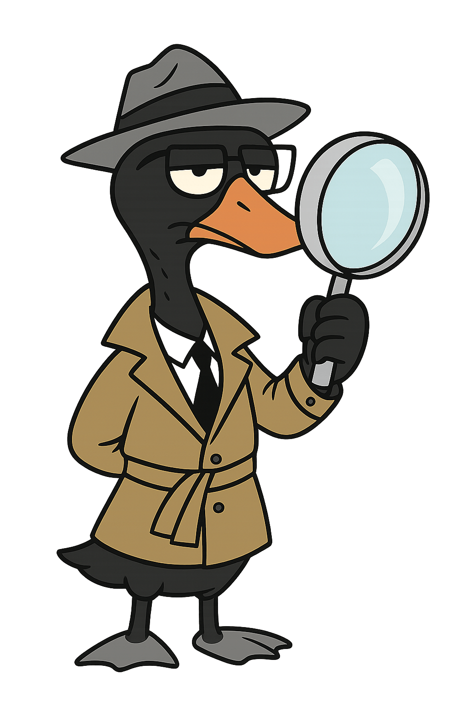

# 🦢 Digital Forensics with a Black Swan Mindset

> *“Not all anomalies are errors. Some are clues.”*

🌍 Available in: [Català](README.ca.md) · [Español](README.es.md)

## 👋 Welcome!

I'm **Pol**, a senior technician in system administration and passionate about **digital forensics**. This repository reflects my approach: precise, ethical, and prepared to detect the unexpected.

---

## 🧠 Why a Black Swan?

The **black swan** is my digital mascot and professional symbol. It represents:

- 🔍 *Rigorous investigation* in uncertain environments  
- 🧭 *Ethical integrity* in technical decisions  
- 🧠 *Critical thinking* to detect digital anomalies  

---

## 📁 Repository Contents

| Folder        | Description                                  |
|---------------|----------------------------------------------|
| `scripts/`    | Forensic tools and automation scripts        |
| `cases/`      | Practical cases in vulnerable environments   |
| `docs/`       | Formal documentation for professional reports|
| `branding/`   | Mascots and visual identity assets           |

---

## 🧩 Technologies & Environments

- 💻 Kali Linux, Metasploitable, legacy Ubuntu  
- 🧪 Wireshark, Nmap, Slowloris, FTP forensics  
- 📜 Bash, Python, Markdown for documentation  

---

## 🧭 Contact & Identity

- 🔗 [GitHub Profile](https://github.com/polpgrau)  
- 🐧 Official Mascot: *Black Swan Forensics*  
- 🌍 Languages: Catalan, Spanish, English  
